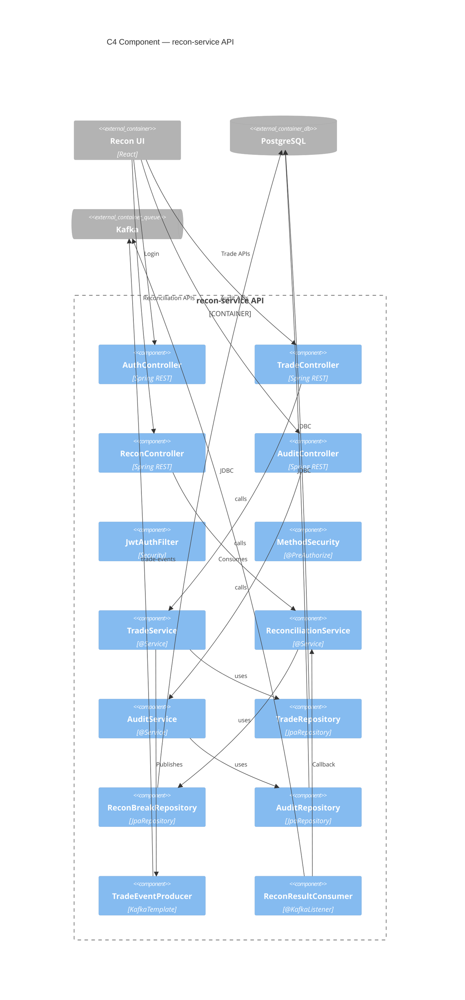

```mermaid
C4Component
    title C4 Component — recon-service API

    Container_Ext(reactSpa, "Recon UI", "React")
    ContainerDb_Ext(postgres, "PostgreSQL")
    ContainerQueue_Ext(kafka, "Kafka")

    Container_Boundary(api, "recon-service API") {

        Component(authCtl, "AuthController", "Spring REST")
        Component(tradeCtl, "TradeController", "Spring REST")
        Component(reconCtl, "ReconController", "Spring REST")
        Component(auditCtl, "AuditController", "Spring REST")

        Component(jwtFilter, "JwtAuthFilter", "Security")
        Component(rbac, "MethodSecurity", "@PreAuthorize")

        Component(tradeSvc, "TradeService", "@Service")
        Component(reconSvc, "ReconciliationService", "@Service")
        Component(auditSvc, "AuditService", "@Service")

        Component(tradeRepo, "TradeRepository", "JpaRepository")
        Component(reconRepo, "ReconBreakRepository", "JpaRepository")
        Component(auditRepo, "AuditRepository", "JpaRepository")

        Component(producer, "TradeEventProducer", "KafkaTemplate")
        Component(consumer, "ReconResultConsumer", "@KafkaListener")
    }

    Rel(reactSpa, authCtl, "Login")
    Rel(reactSpa, tradeCtl, "Trade APIs")
    Rel(reactSpa, reconCtl, "Reconciliation APIs")
    Rel(reactSpa, auditCtl, "Audit APIs")

    Rel(tradeCtl, tradeSvc, "calls")
    Rel(reconCtl, reconSvc, "calls")
    Rel(auditCtl, auditSvc, "calls")

    Rel(tradeSvc, tradeRepo, "uses")
    Rel(reconSvc, reconRepo, "uses")
    Rel(auditSvc, auditRepo, "uses")

    Rel(tradeRepo, postgres, "JDBC")
    Rel(reconRepo, postgres, "JDBC")
    Rel(auditRepo, postgres, "JDBC")

    Rel(tradeSvc, producer, "Publishes")
    Rel(producer, kafka, "trade-events")

    Rel(consumer, kafka, "Consumes")
    Rel(consumer, reconSvc, "Callback")
```