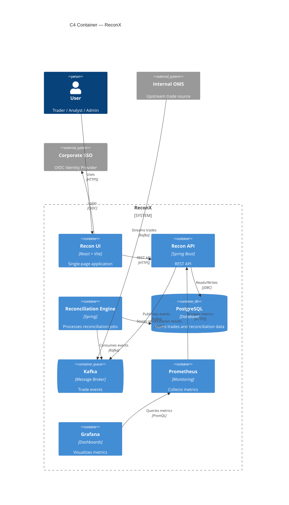

```mermaid
C4Container
    title C4 Container — ReconX

    Person(user, "User", "Trader / Analyst / Admin")
    System_Ext(omsKafka, "Internal OMS", "Upstream trade source")
    System_Ext(sso, "Corporate SSO", "OIDC Identity Provider")

    System_Boundary(reconxBoundary, "ReconX") {

        Container(reactSpa, "Recon UI", "React + Vite", "Single-page application")

        Container(api, "Recon API", "Spring Boot", "REST API")

        Container(reconEngine, "Reconciliation Engine", "Spring", "Processes reconciliation jobs")

        ContainerDb(postgres, "PostgreSQL", "Database", "Stores trades and reconciliation data")

        ContainerQueue(kafka, "Kafka", "Message Broker", "Trade events")

        Container(prometheus, "Prometheus", "Monitoring", "Collects metrics")

        Container(grafana, "Grafana", "Dashboards", "Visualizes metrics")
    }

    Rel(user, reactSpa, "Uses", "HTTPS")
    Rel(reactSpa, api, "REST API", "HTTPS")
    Rel(api, postgres, "Reads/Writes", "JDBC")
    Rel(api, kafka, "Publishes events", "Kafka")
    Rel(reconEngine, kafka, "Consumes events", "Kafka")
    Rel(reconEngine, postgres, "Stores reconciliation results", "JDBC")
    Rel(omsKafka, kafka, "Streams trades", "Kafka")
    Rel(reactSpa, sso, "Login", "OIDC")
    Rel(prometheus, api, "Scrapes metrics", "HTTPS")
    Rel(grafana, prometheus, "Queries metrics", "PromQL")
```